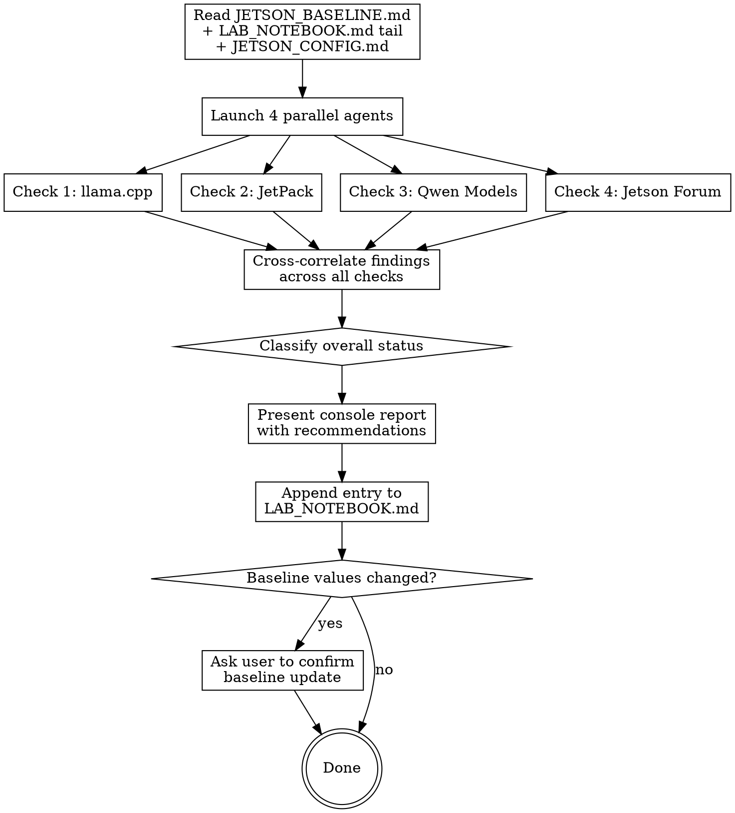

# Jetson Recon

Periodic intelligence scan of the Jetson Orin Nano inference performance landscape. Four parallel checks, compared against stored baselines, classified by urgency, cross-correlated, results appended to LAB_NOTEBOOK.md.

**This skill is report + recommend only. It never touches the Jetson system.**

## Required Files

| File | Location | Purpose |
|------|----------|---------|
| `JETSON_BASELINE.md` | Jetson project root | Performance numbers + last-checked dates + watch items + recon triggers |
| `LAB_NOTEBOOK.md` | Jetson project root | Append-only results log |
| `JETSON_CONFIG.md` | Jetson project root | Hardware/software inventory (read-only reference) |

If `JETSON_BASELINE.md` doesn't exist, create it using the template at the bottom of this skill.

## Execution Flow



## The Four Checks

### Check 1 — llama.cpp Releases

**Data source:** `https://api.github.com/repos/ggml-org/llama.cpp/releases?per_page=5`

**IMPORTANT CONTEXT: We are running llama.cpp natively (NOT vLLM, NOT Ollama). The Jetson Orin Nano Super has SM87 (Ampere GA10B) with CUDA 12.6. Build flags that matter: `CMAKE_CUDA_ARCHITECTURES=87`, `GGML_CUDA_NO_VMM=OFF`, `GGML_CUDA_F16=ON`, `GGML_CUDA_FA_ALL_QUANTS=ON`. Unified memory (CPU+GPU share 7.4 GB LPDDR5).**

**Agent instructions:**
1. `WebFetch` the GitHub releases API.
2. Compare latest release tag against baseline `llamacpp_latest_seen`.
3. If new release(s), scan the release body and linked changelog for keywords and classify:

| Classification | Keywords |
|---------------|----------|
| HIGH | `SM87`, `Jetson`, `Tegra`, `unified memory`, `CUDA 12.6`, `Orin`, `aarch64`, `flash attention` regression/fix, `GGML_CUDA_NO_VMM`, `mlock`, `KV cache` performance |
| MEDIUM | `CUDA`, `GPU offload`, `quantized KV`, `Q4_K_M`, `flash_attn`, `context size`, `memory`, `aarch64`, `ARM`, `NEON` |
| LOW | None of the above |

4. Also check recent commits on main via `https://api.github.com/repos/ggml-org/llama.cpp/commits?per_page=15` for any SM87/Jetson/aarch64-specific changes between releases.
5. If HIGH, generate a concrete test plan:
   - Build commands with our flags (`CMAKE_CUDA_ARCHITECTURES=87` etc.)
   - What to check: throughput delta vs baseline 14.0 tok/s gen, 166 tok/s pp
   - Memory footprint check: must stay under ~4.6 GB RSS
   - Rollback note: current build version from JETSON_BASELINE.md

**Return:** latest version, classification, relevant changelog items, test plan if HIGH, any aarch64/Jetson-specific commits.

### Check 2 — JetPack Updates

**Data sources:** NVIDIA JetPack release page + web search

**IMPORTANT CONTEXT: We are on JetPack 6.2.2 (R36.5.0). JetPack 7.2 is expected Q2 2026 with Ubuntu 24.04, kernel 6.8, CUDA 13.0. A JetPack upgrade requires a full reflash — not a minor operation. We wait 2-4 weeks after any release for community validation.**

**Agent instructions:**
1. `WebSearch` for: `"JetPack 7" release 2026 site:developer.nvidia.com`, `JetPack 7.2 Orin Nano`, `NVIDIA Jetson JetPack latest release`.
2. Also try `WebFetch` on `https://developer.nvidia.com/embedded/jetpack` for the current release page.
3. Compare findings against baseline `jetpack_latest_orin_nano` and `jetpack_next_expected`.
4. Classify:

| Classification | Criteria |
|---------------|----------|
| HIGH | JetPack 7.x officially released with Orin Nano support |
| MEDIUM | JetPack 7.x announced with release date, or new 6.x point release |
| LOW | No new information beyond what's in baseline |

5. If HIGH:
   - Note whether community validation reports exist (forums, Reddit, etc.)
   - Flag if it's been < 2 weeks since release (per our "wait for community validation" policy)
   - Note key changes: CUDA version, kernel, Ubuntu version, driver version
   - Estimate impact on llama.cpp: would we need to rebuild? New CUDA features?
6. If a new JetPack 6.x point release: note if it includes security fixes or driver updates relevant to inference.

**Return:** latest JetPack version available for Orin Nano, classification, release date if new, key changes, community validation status if HIGH.

### Check 3 — Qwen Model Landscape

**Data sources:** HuggingFace + web search

**IMPORTANT CONTEXT: We are running `Qwen3.5-4B-Q4_K_M` (2.6 GB, 14.0 tok/s). The 8 GB unified memory constraint means Q4_K_M quants of 4B models are the sweet spot. 7B models work but leave little headroom. We also run `Qwen3-Embedding-4B-Q4_K_M` for embeddings. We need GGUF format (not safetensors) for llama.cpp.**

**Agent instructions:**
1. If HuggingFace MCP tools are available, use `mcp__a624c60e-e9f3-4088-ad61-015648cddd18__hub_repo_search` to search for recent GGUF models from Qwen org and community quantizers (bartowski, unsloth, mradermacher) with 3B-7B parameters, created after the `models_last_checked_date` in baseline.
2. Also `WebSearch` for: `"Qwen4" model 2026`, `Qwen 4B GGUF new`, `Qwen3.5 successor`, `small language model 4B 2026 GGUF`.
3. We already know about and are running Qwen3.5-4B. Do NOT report it as "new." Look for:
   - New model families (Qwen4, etc.)
   - New fine-tunes of Qwen3.5-4B that might improve quality (especially the `Qwen3.5-4B-Claude-Opus-Reasoning-Distilled-v2` noted in watch items)
   - Competing models in the 3B-5B sweet spot (Gemma, Phi, Llama, etc.) that might outperform at similar memory footprint
   - New GGUF quant variants (e.g., IQ4_XS, Q5_K_M) that could improve quality/speed tradeoff
4. For any genuinely new model: note parameter count, architecture, GGUF availability, estimated file size for Q4_K_M, any published benchmarks at the 4B scale.
5. Don't deep-dive. Flag existence and key specs. Switching models is a separate decision.

**Return:** new models found (or "no new models beyond Qwen3.5-4B"), key specs per model, whether GGUF quants exist, estimated memory fit on Jetson.

### Check 4 — NVIDIA Jetson Forum + Community

**Data sources (use Discourse JSON API — append `.json` to URLs):**
- `https://forums.developer.nvidia.com/c/agx-autonomous-machines/jetson-embedded-systems/jetson-projects/78.json` (Jetson Projects)
- `https://forums.developer.nvidia.com/c/agx-autonomous-machines/jetson-embedded-systems/70.json` (Jetson Embedded Systems)

Also search:
- `WebSearch` for: `Jetson Orin Nano llama.cpp 2026`, `Jetson Orin Nano inference optimization`, `llama.cpp Jetson performance`

Fall back to HTML only if JSON returns an error.

**Agent instructions:**
1. Fetch the JSON endpoints for forum categories.
2. Scan topics created or updated since baseline `forum_last_checked_date`.
3. Flag posts about: llama.cpp on Jetson, inference performance improvements, model optimization for 8GB devices, GGUF benchmarks on Orin, memory optimization techniques, KV cache tuning, new llama.cpp build techniques for Jetson.
4. Also look for community blog posts or GitHub repos with Jetson+llama.cpp benchmarks or optimizations.
5. Classify each relevant post:

| Classification | Criteria |
|---------------|----------|
| ACTION | New performance result, build technique, or config that could improve our 14.0 tok/s baseline |
| INFO | Discussion or benchmark worth reading but not immediately actionable |
| SKIP | Unrelated, basic setup questions, already-known information |

**Return:** post count since last check, ACTION/INFO posts with: title, author, date, link, one-line summary. Any notable community repos or blog posts found via web search.

## Cross-Correlation

After all four agents return, look for findings that appear in multiple checks:
- A llama.cpp release with SM87 improvements AND forum posts confirming Jetson speedups
- A new model appearing in both HuggingFace AND forum benchmarks on similar hardware
- JetPack update AND llama.cpp release that together enable new CUDA features
- Forum optimization techniques that could be applied with the current or a new llama.cpp build

Note cross-correlated findings in the report — these are higher-confidence signals.

## Overall Classification

After cross-correlation:

| Status | Criteria |
|--------|----------|
| **ACTION NEEDED** | HIGH llama.cpp release with SM87/Jetson changes, JetPack 7.x released, or significant new model that fits in 8GB |
| **WORTH WATCHING** | MEDIUM llama.cpp release, new fine-tunes or quant variants, forum optimization techniques, JetPack announced |
| **NO ACTION** | Landscape unchanged from baseline |

## Console Report Format

Present to the user:

```
## Jetson Recon — {DATE}
Overall: {ACTION NEEDED / WORTH WATCHING / NO ACTION}

### llama.cpp: {status}
- Current: {baseline version} — Latest: {latest version}
- Classification: {HIGH / MEDIUM / LOW / NO NEW RELEASE}
{relevant changelog items}
{test plan if HIGH}

### JetPack: {status}
- Current: {baseline version} — Latest available: {latest}
{findings or "No changes from baseline expectations"}

### Qwen / Models: {status}
{findings or "No new models beyond Qwen3.5-4B"}
{new fine-tunes or competing models if any}

### Forum & Community: {status}
- {N} relevant posts since {date}
{ACTION/INFO items}

### Cross-Correlated Findings
{items that appeared in multiple checks, or "None"}

### Recommendations
1. {prioritized actions, or "No action needed — current config remains optimal"}
```

## LAB_NOTEBOOK Entry

Append using `Edit` tool. Auto-increment entry number by reading the last `### Entry NNN` line.

```markdown
### Entry {N} — Jetson Recon ({YYYY-MM-DD})
**Date:** {YYYY-MM-DD HH:MM} UTC
**Operator:** Claude Code (jetson-recon skill)
**Status:** RECON — no changes made

#### llama.cpp Release Check
- Current: {VERSION} — Latest: {VERSION}
- Classification: {HIGH / MEDIUM / LOW / NO NEW RELEASE}
- {Notable items or "No Jetson-relevant changes"}

#### JetPack Check
- Current: {VERSION} — Latest for Orin Nano: {VERSION}
- {Findings or "No updates"}

#### Qwen / Model Check
- {New models or "No new models beyond Qwen3.5-4B"}
- {New fine-tunes or quant variants if any}

#### Forum & Community Check
- {N} relevant posts since {DATE}
- {ACTION/INFO items with links}

#### Cross-Correlated Findings
- {Items appearing in multiple checks, or "None"}

#### Overall: {STATUS}

#### Recommendations
1. {Actions or "No action needed — current config remains optimal for 8GB Orin Nano"}
```

## Baseline Update

After the report, if any **tracking values** changed (llama.cpp version seen, JetPack version, forum check date, model check date):
1. Show specific changes: `llamacpp_latest_seen: b8766 -> b8800`
2. Ask: "Update JETSON_BASELINE.md with these new observed values?"
3. Update only on explicit confirmation.
4. **Never update the `Current Config` section** — that reflects the actual running system, not observed external data. Only the user changes that (after implementing a recommendation).
5. Update the `Watch Items` section with any carry-forward notes (e.g., "JetPack 7.2 released, community validating", "test new Qwen fine-tune next session").
6. Update the `Recon Triggers` table if new triggers are identified.

## JETSON_BASELINE.md Template

Create this file in the Jetson project root if it doesn't exist:

```markdown
# Jetson Performance Baseline

Last updated: {DATE}
Last recon: {DATE}

## Current Config
| Field | Value |
|-------|-------|
| device | Jetson Orin Nano Super 8GB |
| jetpack_version | 6.2.2 (R36.5.0) |
| cuda_version | 12.6 |
| llamacpp_version | b8766 |
| current_model | Qwen3.5-4B-Q4_K_M |
| baseline_gen_tok_s | 14.0 |
| baseline_pp_tok_s | 166 |
| baseline_rss_mb | 4631 |
| context_size | 32768 |
| gpu_layers | 999 (full offload) |
| threads | 1 |
| parallel_slots | 1 |
| kv_cache_type | q8_0 |
| flash_attn | on |
| mlock | on |

## Version Tracking
| Field | Value |
|-------|-------|
| llamacpp_latest_seen | b8766 |
| jetpack_latest_orin_nano | 6.2.2 |
| jetpack_next_expected | 7.2 (Q2 2026, Orin support) |

## Model Tracking
| Field | Value |
|-------|-------|
| current_model | Qwen3.5-4B-Q4_K_M |
| current_embedding_model | Qwen3-Embedding-4B-Q4_K_M |
| models_last_checked_date | {DATE} |

## Forum Tracking
| Field | Value |
|-------|-------|
| forum_last_checked_date | {DATE} |

## Recon Triggers
| Source | Pattern | Action | Added |
|--------|---------|--------|-------|
| jetpack | JetPack 7.2 AND (Orin Nano OR Orin) | ACTION: Evaluate JetPack 7.2 upgrade | {DATE} |
| llamacpp_release | SM87 OR Jetson OR Tegra OR unified memory | ACTION: Check for Jetson-specific improvements | {DATE} |
| huggingface | Qwen4 OR Qwen3.5 successor | INFO: New generation may improve quality at same size | {DATE} |
| forum | llama.cpp AND (performance OR optimization) AND jetson | INFO: Community techniques to evaluate | {DATE} |

## Watch Items
- {Carry-forward notes from previous recon runs}
```
